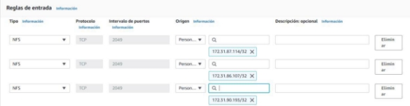
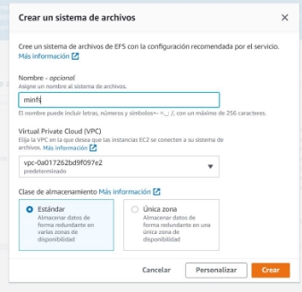
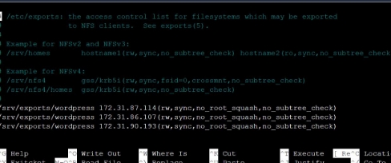
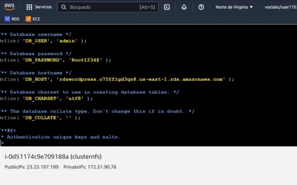
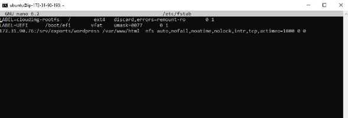
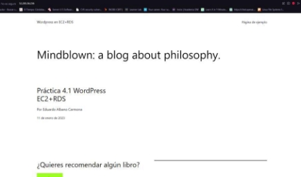

Eduardo Albano Carmona 2ºASIR  19/01/2023 

**Arquitectura 3 niveles con NFS **

[Preparación previa: ............................................................................................................................. 3 ](#_page2_x82.00_y71.00)[Arquitectura: ....................................................................................................................................... 3 ](#_page2_x82.00_y118.00)[Software: ............................................................................................................................................. 4 ](#_page3_x82.00_y71.00)[Configuracion nfs: ............................................................................................................................... 4 ](#_page3_x82.00_y279.00)[Servidores web configuración: ............................................................................................................ 6 ](#_page5_x82.00_y395.00)[Referencias: ......................................................................................................................................... 7 ](#_page6_x82.00_y470.00)

**Preparación previa:** 

En este caso partimos de maquinas de ec2 creadas en una[ practica ](https://moodle.iesgrancapitan.org/pluginfile.php/60620/mod_resource/content/1/IAWJimenezCaroSandraMejiasBendalaJose-DocumentoTecnico.pdf)anterior 

**Arquitectura:** 

Servidor NFS: 

- Sistema operativo: Ubuntu 22.04 
- Almacenamiento: t2.micro 
- VPC: En la misma del resto de las EC2 
- Asignada IP elástica 
- Configuración de red y seguridad 

Solo necesitamos darle acceso a las maquinas ec2 a través del puerto 2049 que será por donde trabajara NFS 

Ips privadas: 

|Servidores web |172.31.87.114 172.31.86.107 172.31.90.193 |
| - | - |
|Servidor nfs |172.31.90.76|
**Software:** 

Servidores web: 

- Apache2 
- PHP 
- PHP-mysql 
- Nfs-common 
- Wordpress 

Servidor nfs 

- Nfs-kernel-server 

**Configuracion nfs:** 

Creamos nuestro nfs: 

Lo primero que debemos realizar es la instalación del servidor de nfs con el siguiente comando: sudo apt-get install nfs-kernel-server 

Crearemos una carpeta para almacenar nuestro wordpress con el siguiente comando: 

sudo mkdir -p /srv/exports/wordpress 

Descargaremos wordpress a través de wget y posteriormente lo descomprimiremos con los siguientes comandos: 

wge[t https://es.wordpress.org/latest-es_ES.tar.gz ](https://es.wordpress.org/latest-es_ES.tar.gz)

tar xzvf latest-es\_ES.tar.gz wordpress/sudo cp -r wordpress\* /srv/exports/wordpress/ 

Instalaremos los diferentes php para no tener posibles problemas con la visualización de los contenidos 

sudo apt install php-curl php-gd php-mbstring php-xml php-xmlrpc php-soap  php-intl php-zip 

Nos dirigimos a /etc/exports para añadir las siguientes líneas para otorgar permisos a nuestros servidores web: 

Para saber si no hay ningún fallo en la configuración o de sintaxis, con “sudo exportfs” se exportara la configuración a nuestras maquinas: 

Para finalizar editaremos el archivo con sudo nano /srv/exports/wordpress/wp-config.php y establecemos los datos de la rds configurada previamente en la practica anterior. 

**Servidores web configuración:** 

Para empezar instalamos nfs-common con sudo apt install nfs-common. 

Una vez instalado montaremos el wordpress con el siguiente comando en el que se indicara la ip de nuestro servidor nfs con la ruta establecida anteriormente y el destino en nuestra maquina: 

Con df -h podremos comprobar si se ha montado correctamente. 

Ya que estos montajes se borran al reiniciar, accedemos y editamos /etc/fstab y añadimos la siguiente línea: 

Por último **reiniciaremos** nuestras instancias en AWS y comprobamos que funciona correctamente. 

**Referencias:** 

https://github.com/EduAlbanoCarmona/IAW-Arquitectura-3-niveles 
7 
