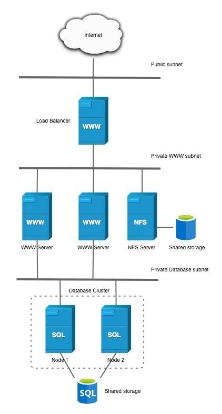
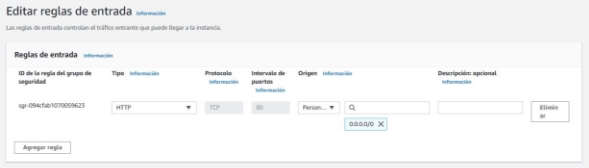
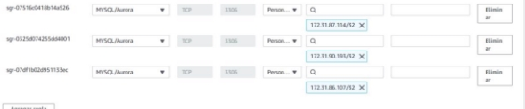
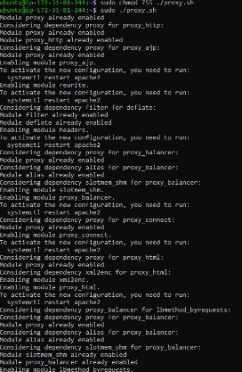
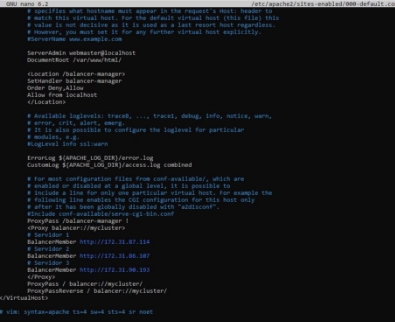
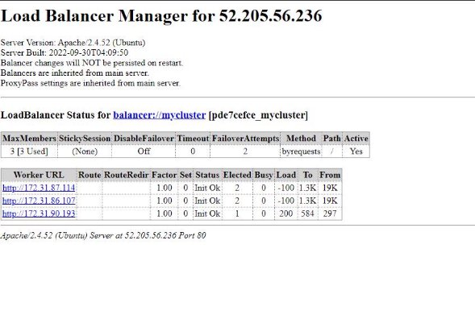

Eduardo Albano Carmona 2ºASIR  16/01/2023 

**Instalar Wordpress en arquitectura 3 niveles **

[Preparación previa: ............................................................................................................................. 3 ](#_page2_x82.00_y71.00)[Arquitectura: ....................................................................................................................................... 3 ](#_page2_x82.00_y179.00)[Fases de la practica: ............................................................................................................................ 4 ](#_page3_x82.00_y71.00)[Infraestructura y software: ................................................................................................................. 4 ](#_page3_x82.00_y136.00)[Creación de la EC2 proxy ..................................................................................................................... 6 ](#_page5_x82.00_y416.00)

**Preparación previa:** 

Anteriormente se ha montado una arquitectura all in one y una EC2+RDS que son necesarios para la realización de este proceso siguiendo los siguientes pasos indicados en el siguiente documento 

[https://moodle.iesgrancapitan.org/mod/resource/view.php?id=35872 ](https://moodle.iesgrancapitan.org/mod/resource/view.php?id=35872)

**Arquitectura:** 

La estructura que realizaremos será la siguiente: 

Necesitamos:  

1 Servidor NFS 

2 Servidores web (EC2) 

1 Servidor SQL (RDS) 

1 Balanceador de carga (Proxy) 

**Fases de la practica:** 

Fase 1 : Instalación de wordpress en un nivel 

Fase 2 : Instalación de wordpress en dos niveles (Realizado en la preparación previa) 

Fase 3 : Instalación de wordpress en tres niveles (balanceador,web,nfs,mysql) 

**Infraestructura y software:** 

**Infraestructura:**  

- 3 Servidores wordpress:  

2 de los servidores tienen esta configuración: 

- Las maquinas tienen Ubuntu 22.04. 
- El tipo de instancia es t2.micro. 
- Están en la misma VPC. 
- Les tendremos que asignar una ip elástica a cada una. 
- Configuración de red y seguridad (Reglas de entrada): 

- Servidor NFS (aun por realizar) 
- Servidor SQL: 

` `-1 maquina RDS 

` `-MYSQL 

- Configuración de red y seguridad: 

**Software:** 

- 3 Servidores wordpress** 

Paquetes instalados: Apache2 , PHP y MySQL 

- Servidor NFS (aun por hacer) 
- Servidor SQL 
- Balanceo de carga 

Paquetes instalados: PHP, Apache2 

Para habilitar los módulos necesarios he creado un script para la automatización de los módulos 

Se debe esperar un resultado similar a este: Importante resetear el servicio apache2 después de su ejecución  

**Creación de la EC2 proxy** 

En /etc/apache2/sites-enabled/000-default.conf a traves de un editor como nano debemos aplicar la siguiente configuracion para configurar el proxy y el balanceador de carga. 

Reglas de seguridad: 

El balanceador de carga distribuye la carga entre los workers EC2  

Comprobamos el balanceador de carga accediendo desde la ip publica/balancer-manager para comprobar que está balanceando correctamente entre las maquinas EC2. 

7 
