Eduardo Albano Carmona 2ºASIR  24/01/2023 

**Instalar web con NFS **

[Arquitectura: ....................................................................................................................................... 3 ](#_page2_x82.00_y71.00)[Software: ............................................................................................................................................. 5 ](#_page4_x82.00_y455.00)[Configuracion EC2: .............................................................................................................................. 6 ](#_page5_x82.00_y245.00)[Proxy.................................................................................................................................................... 9 ](#_page8_x82.00_y71.00)[Referencias: ....................................................................................................................................... 11 ](#_page10_x82.00_y415.00)

**Arquitectura:** 

Servidores web EC2  Linux\_01 Linux\_02: 

- Sistema operativo: Amazon Linux 
- Almacenamiento: t2.micro 
- VPC: Misma VPC en toda la arquitectura 
- Configuración de red y seguridad Subredes: Linux 01: zone us-east 1a  

`    `Linux 02: zone us-east 1b 

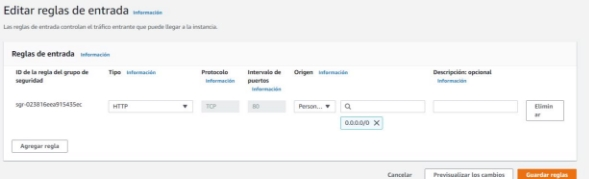

Servidor Proxy ProxyNFS: 

- Sistema operativo: Ubuntu 
- Almacenamiento: t2.micro 
- VPC: Misma VPC en toda la arquitectura 
- Configuración de red y seguridad 

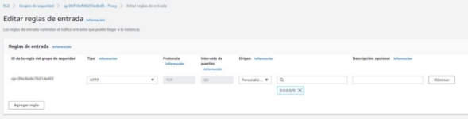EFS: La creación de la EFS es simple, trabajara en la misma VPC y usaremos la estándar para abarcar mas zonas de disponibilidad. 

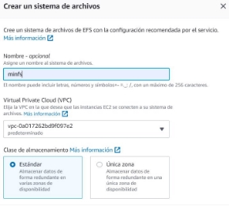

Seguridad: En este caso añadimos el grupo de seguridad para permitir solo al que pertenezca el acceso por el puerto 2049 que es usado para EFS 

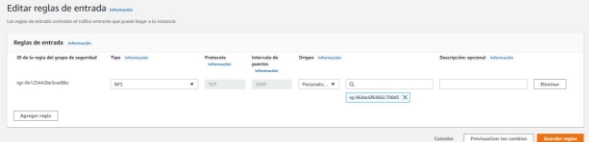

Es importante acceder al apartado red de nuestro nfs y añadir nuestro grupo de seguridad a las disponibles zonas, en principio solo necesitaríamos las zonas “a” y “b” pero se lo asignamos a todas para posibles futuras expansiones. 

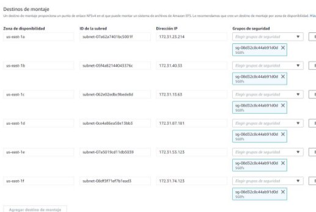

|Servidores web |172.31.18.248 172.31.36.4 |
| - | :- |
|Proxy |172.31.54.11 |
**Software:** 

Servidores web: 

- Httpd 
- Nfs-utils 
- Apache2 

Proxy: 

- Apache2 
- PHP 

**Configuracion EC2:** 

Cambiamos al directorio con cd /var/www/html  y creamos la carpeta efs-mount por comodidad y introducimos el siguiente comando para montar nuestro nfs. Es importante cambiar la parte que pone fs-ymuchos números por la identificación de nuestro nfs fs-00a4e3d4ee5204c0a 

sudo mount -t nfs -o nfsvers=4.1,rsize=1048576,wsize=1048576,hard,timeo=600,retrans=2,noresvport fs- 00a4e3d4ee5204c0a.efs.us-east-1.amazonaws.com:/ efs-mount 

Comprobamos que ha sido montado con df -h 

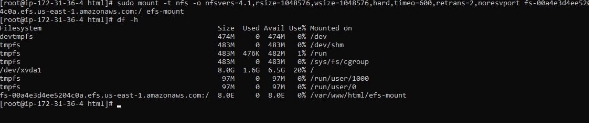

Dentro de la carpeta efs-mount usamos un wget y la url de la web en este caso la web que alija un clon de Netflix 

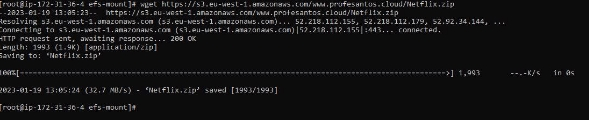

Comprobamos que se ha descargado y lo descomprimimos 

Estas acciones hay que realizarlas en ambos Linux\_EC 

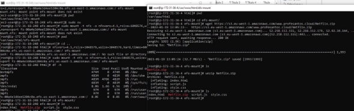

Comprobamos el contenido de index.html 

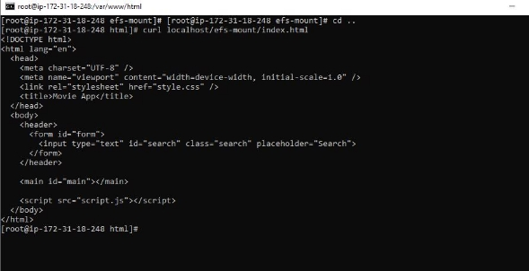

Si accedemos desde la ip publica/efs-mount/index.html veremos que se visualiza nuestra web 

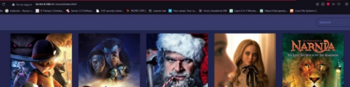

Accedemos a /etc/httpd/cnf/httpd.conf y lo editamos con nano hasta la siguiente línea y añadimos /efs-mount en ambas dos maquinas 

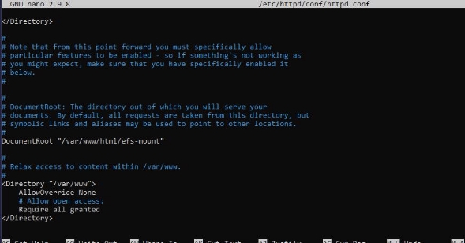

Importante no olvidar resetear el servicio 

Es importante añadir en /etc/fstab la siguiente línea para que cada vez que inicie la maquina se automonte en cada una de las maquinas EC2 

**Proxy** 

Para mejorar esta infraestructura añadimos un servidor proxy que balanceara entre nuestras maquinas. 

Lo primero que debemos hacer es habilitar  los modulos del proxy con los siguientes comandos: 

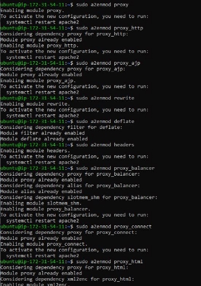

Por ultimo accedemos al archivo de configuración en /etc/apache2/sites-enabled-000-default.conf y añadimos las siguientes líneas para el balanceador de carga con las ip de las ec2 en los balance- member. No olvidar cambiar el documentroot para una url mas directa. 

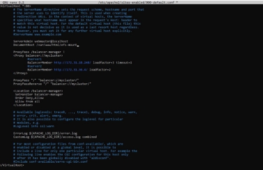

Comprobamos el resultado: 

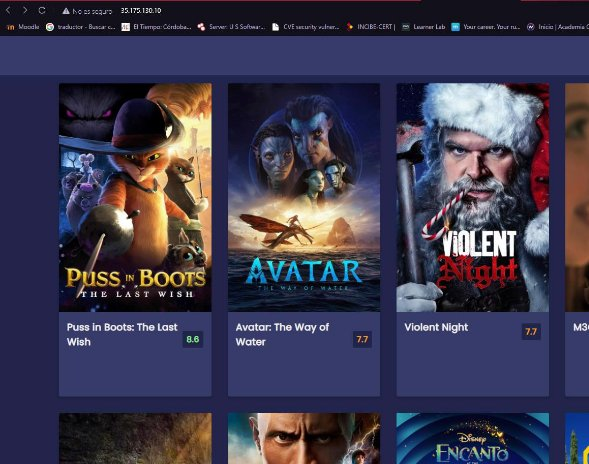

Y entramos en el balanceador para comprobar si esta funcionando: 

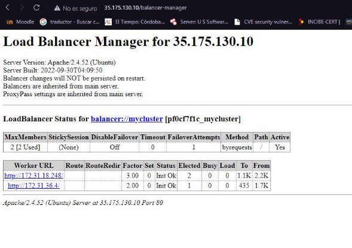

**Referencias:** 

https://github.com/EduAlbanoCarmona/IAW-Arquitectura-3-niveles 
10 
