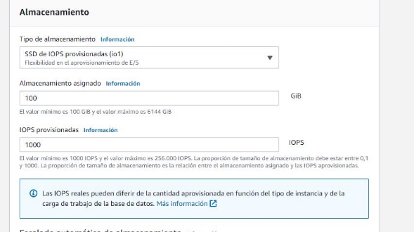

Eduardo Albano Carmona 2ºASIR  24/01/2023 

**Despliegue cluster web con EBS y multiAZ **

[Arquitectura: ....................................................................................................................................... 3 ](#_page2_x82.00_y71.00)[Software: ............................................................................................................................................. 4 ](#_page3_x82.00_y71.00)[Configuración RDS: .............................................................................................................................. 4 ](#_page3_x82.00_y254.00)[EC2 windows ....................................................................................................................................... 9 ](#_page8_x82.00_y71.00)[Referencias: ....................................................................................................................................... 16 ](#_page15_x82.00_y71.00)

**Arquitectura:** 

Servidor base de datos RDS clusterrds: 

- Motor: MYSQL 
- Almacenamiento: t2.micro 
- VPC: Misma VPC en toda la arquitectura 
- Configuración de red y seguridad: 

Se le asigna que solo los que pertenezcan al grupo de seguridad sgweb de la practica anterior pueda acceder  

Servidor EC2 Windows: 

- Sistema operativo: Windows Server 2022 capa gratuita 
- Almacenamiento: db.t3.micro 
- VPC: Misma VPC en toda la arquitectura 
- Configuración de red y seguridad 

En este caso agregamos RDP para usar el control remoto , en este caso esta accesible para todas las ips 

**Software:** 

RDS: 

- Ofrecida por AWS 

EC2 Windows: 

- HeidiSQL 

**Configuración RDS:** 

Comenzamos creando una nueva RDS y escogiendo como motor MySQL 

Escogeremos la opción producción para una alta disponibilidad y rendimiento 

Escogeremos la opción de Instancia de base de datos multi-az que se refiere a una implementación de alta disponibilidad en la que se utiliza un segundo servidor como un respaldo automático en caso de una interrupción en el servidor primario. La base de datos se replica automáticamente entre los servidores, lo que garantiza que los datos estén siempre disponibles y protegidos ante posibles fallos de hardware o de software 

Clase con ráfagas es adecuada para aplicaciones que requieren una capacidad de CPU adicional para manejar picos de tráfico. La clase de ráfagas proporciona una capacidad adicional de CPU para manejar estos picos 

Establecemos el almacenamiento mínimo posible para un menor consumo de presupuesto 

Le damos a las opciones por defecto y estableceremos que sea de acceso publico temporalmente 

Lanzamos para crear la base de datos, en la parte superior nos aparecerá un mensaje de permisos,  que por el momento ignoraremos ya que no nos afecta a la hora de realizar esta práctica 

Una vez creada podemos comprobar que todo ha ido bien y el apartado Multi-AZ que nos permitirá conectarnos en diferentes regiones esta en “Sí” 

**EC2 windows** 

Accedemos al panel de EC2 y vamos a crear una maquina con Windows 

Escogemos la versión de la capa gratuita Microsoft Windows Server 2022 Base 

Escogemos en el par de claves vockey y seleccionamos el grupo de seguridad anteriormente creado en practicas anteriores (señalizado en la parte superior de este documento) SGweb 

Lanzamos la instancia ec2 

Le damos al apartado Conectar y la pestaña Cliente de RDP 

En la parte inferior encontraremos la opción Obtener contraseña y nos guiara al siguiente menu 

Vamos a nuestro apartado de AWS (fuera del laboratorio) en AWS Details y pulsamos en Download PEM, esto nos bajara nuestra clave necesaria para el siguiente paso

Continuamos y cargamos la clave privada recién descargada: Con esto obtendremos nuestra contraseña para acceder por un escritorio remoto a nuestro Windows 

La contraseña aparecerá abajo , la copiamos y pulsamos en descargar archivo de escritorio remoto 

Aceptamos y esperamos y estaremos en nuestro Windows 

Accederemos a la web oficial de heidiSQL y lo descargaremos 

Procedemos instalarlos dándole a siguiente hasta finalizar 

Lo ejecutamos y creamos una conexión con el hostname de nuestra rds incluyendo nombre de usuario y contraseña 

En la siguiente practica partiremos de esta base de datos 

**Referencias:** 

https://github.com/EduAlbanoCarmona/IAW-Arquitectura-3-niveles 
15 
