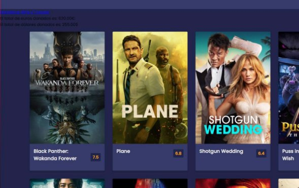

Eduardo Albano Carmona 2ºASIR  24/01/2023 

**Práctica 4.5 : Finalizar escenario Clúster web **

[Arquitectura: ....................................................................................................................................... 3 ](#_page2_x82.00_y71.00)[Software: ............................................................................................................................................. 3 ](#_page2_x82.00_y492.00)[Base de datos: ..................................................................................................................................... 4 ](#_page3_x82.00_y71.00)[Configuración EC2 ............................................................................................................................... 4 ](#_page3_x82.00_y585.00)[Referencias: ......................................................................................................................................... 9 ](#_page8_x82.00_y294.00)

**Arquitectura:** 

Servidor base de datos RDS clusterrds de la práctica anterior: 

- Configuración de red y seguridad: 

Se le asigna que solo los que pertenezcan al grupo de seguridad sgweb de la práctica anterior pueda acceder  

Servidor EC2 Windows de la práctica anterior: 

- Configuración de red y seguridad 

En este caso agregamos RDP para usar el control remoto , en este caso esta accesible para todas las ips 

**Software:** 

RDS: 

- Ofrecida por AWS 

EC2 Linux: 

- PHP 

**Base de datos:** 

Procedemos a crear la tabla con los siguientes valores: 

Si hacemos una consulta simple al campo veremos que se almacenan los datos( una vez que completemos la práctica) 

**Configuración EC2** 

Instalamos php en ambas maquinas EC2 linux con el siguiente comando: 

A continuación modificaremos ciertos archivos dentro de nuestra ec2, al estar todos estos archivos en efs-mount se modificara en ambas maquinas. 

Al archivo conexión.php se le ha añadido los datos para la base de datos 

En nuestro formulario.php han sido añadidas los campos de la base de datos además de un estilo en css. 

El siguiente archivo es grabar.php. que será el que se encargue de insertar los datos en nuestra base de datos 

Accedemos a la web y vemos que con pruebas posteriores carga la cantidad de euros y dólares. 

Insertamos 20 euros mas para hacer la prueba. 

Nos indica que se ha grabado correctamente 

Y el contador de euros subió en 20€ 

Es importante securizar , proporcionando solo http a través de la ip del proxy para que todo el que quiera acceder lo hará a  través del proxy. 

**Referencias:** 

https://github.com/EduAlbanoCarmona/IAW-Arquitectura-3-niveles 
8 
